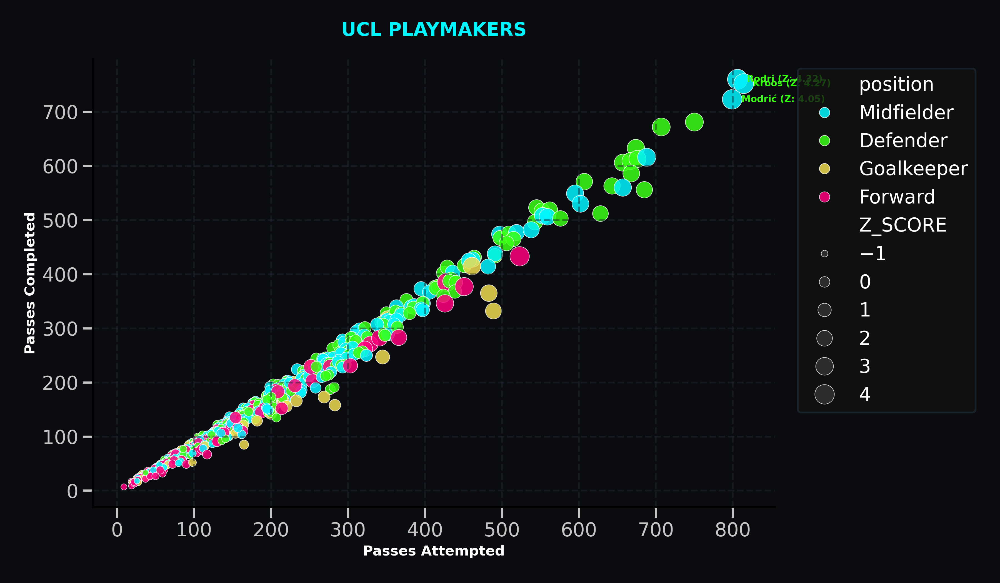
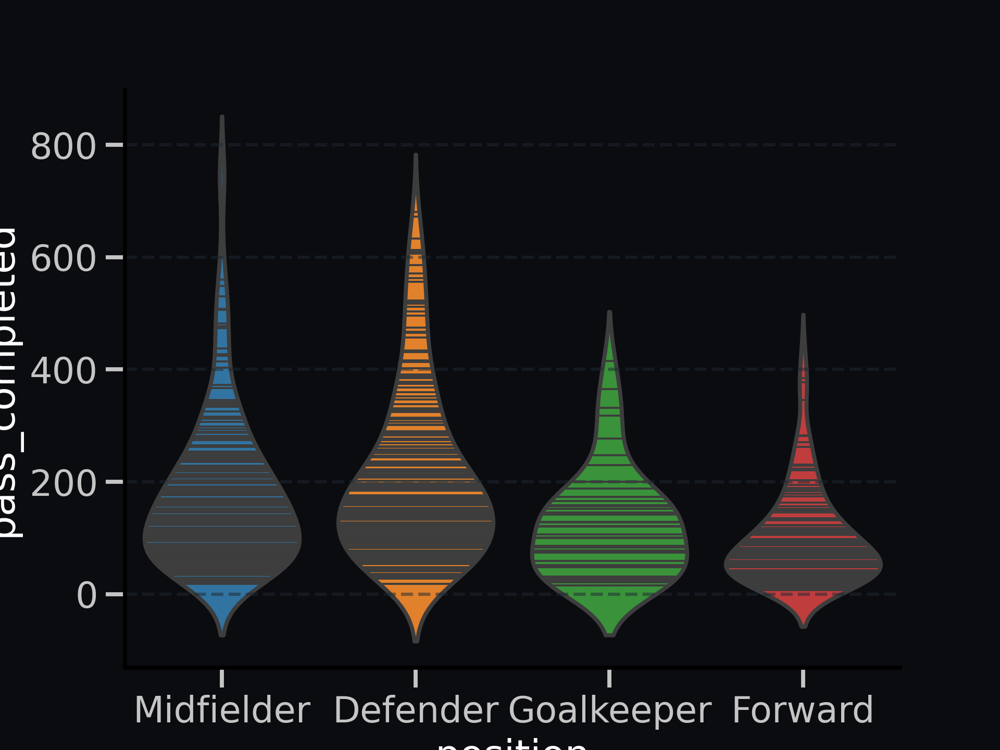
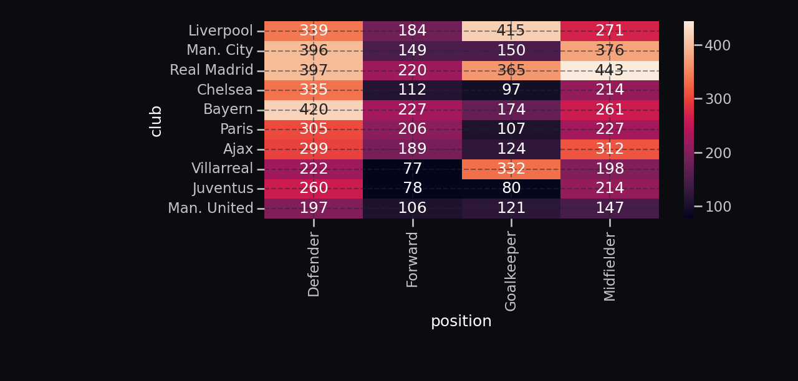

# Regista: UCL Playmaking Telemetry Analytics

Named after the deep-lying playmaker role in football, Regista is a statistical data mining pipeline designed to filter, analyze, and visualize playmaking metrics from the 2021-22 UEFA Champions League (UCL) season. This project utilizes position-stratified modeling to uncover distribution efficiencies and identify performance outliers.

---

## 1. Author's Note

This project started because I wanted to combine my favorite sport with data analytics. Broadcast TV stats only tell half the story, so I used this as an opportunity to push myself with Pandas and figure out how to isolate real match impact. Television graphics love showing basic completion percentages, but they ignore the nuance of positional context and passing difficulty. I wanted to build an engine that could differentiate between a safe sideways pass by a center-back and a high-value, line-breaking ball from a deep-lying playmaker.

Instead of looking at player stats globally, I wanted to evaluate them against their exact positional peers. Writing the Grouped Consistency Index (`gci`) function forced me to think about statistical normalization, specifically, how to compute dynamic Z-scores across distinct groups (Defenders, Midfielders, Forwards) to find the true statistical "bosses" of the tournament. Designing the custom neon dark-mode themes for the Seaborn plots was a lot of fun and it really helped bring out the insights visually. This project showed me how powerful a few well-crafted statistical masks can be when uncovering hidden stories in sports data.

>Here we go!
---

## 2. Core Technical Pipeline & Reference

The analytical engine processes raw player telemetry matrices by leveraging vectorized Pandas mapping and grouping.

### Targeted Telemetry Inquiries

* **`high_volume()`:** Filters and isolates players meeting high-threshold passing volume parameters (passing accuracy >85% with more than 200 total attempts) to identify the engine rooms of the tournament.
* **`freekick_master()`:** Sorts and reveals the top 5 deadliest set-piece specialists based on raw free kicks taken.
* **`unused()`:** Identifies attacking players (Midfielders/Forwards) who played at least 3 matches but never attempted a single cross, uncovering structurally narrow play styles.
* **`cross_audit()`:** An internal data-integrity mask. It manually recalculates cross accuracy percentages from raw completions and flags records where the computed values deviate from the dataset's pre-recorded accuracy metric.
* **`pass_per_match()`:** Evaluates operational passing density per game for players with a minimum of 5 appearances to surface high-frequency distributers.
* **`blind_crosser()`:** Isolates players whose crossing frequency makes up an overwhelmingly disproportionate volume (>20%) of their total pass attempts.
* **`team_pass()`:** Groups data by constructor clubs (`groupby("club")`) to calculate cumulative passing volumes and evaluate overall team distribution accuracy.
* **`position_pass()`:** Aggregates passing traits across broad positions to calculate average baseline accuracy metrics and peak passing volumes.
* **`outlier_check()`:** Validates structural integrity across rows by flagging any illogical instances where completed passes exceed attempted passes.
* **`final_boss()`:** Isolates maximum-efficiency playmakers. It targets players with $\ge 5$ matches played who average over 50 completed passes per game, maintain $>88\%$ accuracy, and attempt fewer than 5 crosses (the archetypal deep-lying tempo controllers).
* **`club_perc()`:** Utilizes percentile ranking (`rank(pct=True)`) grouped by club to isolate elite distribution assets sitting in the top 15% (`>0.85`) of their respective squads.

### Advanced Statistical Modeling

* **Grouped Consistency Index (`gci()`):** Bypasses global averages by computing position-stratified **Z-scores**. It transforms the dataset by calculating the distinct mean ($\mu$) and standard deviation ($\sigma$) for each positional cluster, assigning each player a relative deviation index:
  $$Z = \frac{x - \mu}{\sigma}
  
**`plot_final_boss()`:** A visualization module that applies a custom neon aesthetic theme, maps multi-variable scatter parameters (Passes Attempted vs. Completed), scales point sizes based on calculated Z-scores, and dynamically labels elite performers ($Z > 4.0$).



* **`inner_view()`:** Generates density distribution profiles using a Seaborn `violinplot` layered with localized data markers (`inner='sticks'`) to visualize passing volumes across groups.



* **`club_master()`:** Creates an interactive team-wide heatmap (`sns.heatmap`) evaluating the top 10 clubs sorted by average passing completions stratified across tactical positions.



---

## 3. Tech Stack & Dependencies

* **Language Runtime:** Python 3.10+
* **Data Processing Engine:** Pandas, NumPy
* **Data Visualization Suite:** Matplotlib, Seaborn

---

## 4. Quick Start & Execution

### 1. Installation
Ensure your runtime environment contains the necessary data processing and visualization libraries:
```bash
pip install pandas seaborn matplotlib
```
### 2. Execution
Ensure `Midfield_Playmaking.csv` is situated in the project directory, then run the analytical execution block:
```Bash
python reg.py
```

## Authors & Data Attribution

* **Developer:** [Sameeha Yasmin](https://github.com/Sam4907)
* **Data Source:** Statistics derived from the 2021-22 UEFA Champions League midfield playmaking dataset hosted on [Kaggle](https://www.kaggle.com/datasets/azminetoushikwasi/ucl-202122-uefa-champions-league)